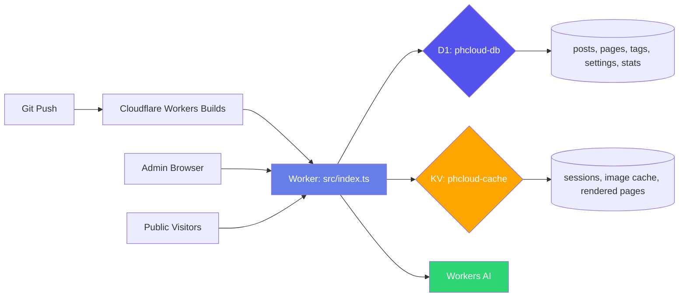

<div style="background:linear-gradient(135deg,#667eea 0%,#764ba2 100%);padding:2.5rem 2rem;border-radius:14px;margin:1rem 0 2rem;color:#fff;text-align:center">
<h1 style="margin:0;font-size:2.2rem;letter-spacing:-0.02em">☁️ PHCloud CMS</h1>
<p style="margin:.6rem 0 0;font-size:1.15rem;opacity:.92;max-width:640px;margin-left:auto;margin-right:auto">
One Worker. Zero servers. Free forever on Cloudflare's edge.
Push to <code>main</code> — your site is live in 60 seconds.
</p>
</div>


---

> [!NOTE]
> Fork it, paste two IDs, deploy. No Docker, no monthly bill, no keys to manage.

> [!TIP]
> New to Cloudflare? The free tier covers everything — Workers, D1, KV, and Workers AI. No credit card required.

---

## What is PHCloud

PHCloud is a self-hosted CMS designed for exactly **one site** — your blog, portfolio, or small business. Content is authored in a browser-based WYSIWYG editor, stored as HTML in a Cloudflare D1 (SQLite) database, and rendered through a static theme compiled into a single Worker.

**Stack footprint:** `hono` (one dependency). No build step. No Node.js on the edge. No framework runtime deployed.

---

## Why it's different

| | PHCloud | WordPress | Ghost | Netlify CMS |
|---|---------|-----------|-------|-------------|
| Monthly cost | **$0** | $7–45/mo | $9–199/mo | $0 (+ hosting) |
| Infrastructure | 1 Worker | PHP + MySQL | Node + DB | Git repo |
| Setup time | **60 sec** | 15–30 min | 10–20 min | 30+ min |
| AI built-in | Workers AI | Plugin | Add-on | None |
| Edge-rendered | ✅ | ❌ | ❌ | Static only |
| MCP server | ✅ | ❌ | ❌ | ❌ |
| Self-hosted | On your Cloudflare account | Your server | Your server | Git provider |
| Theme system | 1 file, swap theme in seconds | PHP themes | Handlebars | Static site |

---

## Architecture



```
One Worker entry (src/index.ts)
  ├── src/routes/     HTTP handlers (posts, pages, tags, auth, MCP, install, public)
  ├── src/admin/      Full admin UI (editor, dashboard, settings, images)
  ├── src/cms/        Framework: auth, D1 migrations, sanitizer, render, stats, AI
  ├── src/themes/     default.ts — compiled CSS theme, swap or reskin in one file
  └── src/plugins/    Hook system (sitemap, head/body injection)
```

---

## Features

| Feature | What it does |
|---------|-------------|
| **Admin panel** | Dashboard + CRUD for posts, pages, tags, nav, settings |
| **WYSIWYG editor** | `contentEditable` with formatting toolbar (bold, italic, H2/H3, link, image, blockquote, list). Selection-aware toolbar state |
| **Live preview** | Renders unsaved edits through the live theme as you type |
| **Version history** | Every save snapshots the post; restore any version from the editor |
| **SEO panel** | Per-post and per-page meta title/description with live counters + Google snippet preview |
| **Autosave** | Drafts saved to `localStorage`; restore after accidental close |
| **AI writing assistant** | Continue, summarize for excerpt, rewrite (tone selector), suggest titles, generate SEO meta — free Workers AI, ~10k neurons/day |
| **Stats dashboard** | 30-day view counts, top pages, sparkline — in D1, no external script |
| **Scheduled posts** | Publish immediately or schedule; drafts get a private preview link |
| **Image upload** | Paste/drag → resize ≤1200px → WebP 0.7 quality → stored in D1 → served `/img/:id` from KV, immutable cache |
| **Pages** | Static pages (About, Contact, Privacy) alongside posts |
| **Tags** | Organize posts; browse at `/tag/:slug` |
| **Navigation** | Custom header links, editable from admin |
| **Search** | Full-text at `/search?q=…` |
| **RSS feed** | Auto at `/feed.xml` |
| **XML sitemap** | Auto at `/sitemap.xml` |
| **llms.txt** | AI-readable site index for LLMs and citation engines |
| **MCP server** | `POST /api/mcp` — MCP 2026-07-28 spec; AI agents read/create/update/publish via bearer token |
| **Plugin system** | Hook-based plugins (sitemap, head/body injection), toggle in admin |
| **Themes** | One static TS file compiled into Worker; light/dark via `prefers-color-scheme` + toggle, reskin by editing `:root` variables |
| **Hero kicker** | Editable small label above site name in Settings (leave empty to hide) |
| **Onboarding wizard** | First-run browser setup: admin account, site name, defaults |
| **Auth** | PBKDF2 password hashing (Web Crypto, 100k iterations), HTTP-only cookies, KV-backed sessions |
| **Caching** | Posts, settings, nav in KV; images in KV (30-day TTL); invalidated on publish/edit/delete |

---

## Security

| Header / Setting | Value |
|---|---|
| Content-Security-Policy | `default-src 'self'`; nonce-bound scripts |
| Strict-Transport-Security | `max-age=31536000; includeSubDomains` |
| X-Frame-Options | DENY |
| X-Content-Type-Options | nosniff |
| Referrer-Policy | `strict-origin-when-cross-origin` |
| Permissions-Policy | camera/mic/geolocation disabled |

HTML sanitizer (allowlist tokenizer, no DOMPurify) runs on **both write and read**. No `style` attributes, no `data:` URLs in content.

---

## Stacks

| Layer | Technology |
|---|---|
| Runtime | [Cloudflare Workers](https://developers.cloudflare.com/workers/) |
| Framework | [Hono v4](https://hono.dev) |
| Database | [D1](https://developers.cloudflare.com/d1/) (serverless SQLite) |
| Cache | [Workers KV](https://developers.cloudflare.com/kv/) |
| AI | [Workers AI](https://developers.cloudflare.com/workers-ai/) — `@cf/meta/llama-3.1-8b-instruct-fast` |
| Schema | Idempotent migrations + backfill, versioned with KV gate |
| Language | TypeScript |

**One runtime dependency:** `hono`. No markdown parser, no DOMPurify, no client framework.

---

## Quick start

> [!IMPORTANT]
> You need **two free accounts** — GitHub and Cloudflare. No credit card on either.

- **Fork** [github.com/Stevechaapps/phcloudcms](https://github.com/Stevechaapps/phcloudcms)
- **Create a D1 database** → `phcloud-db` → copy the ID
- **Create a KV namespace** → `phcloud-cache` → copy the ID
- **Replace the IDs** in `wrangler.toml`
- **Deploy**

### Path A — Workers Builds (auto-deploy)

1. Cloudflare Dashboard → Workers & Pages → Create → Continue with GitHub
2. Select your fork, branch `main`
3. Build command: leave blank. Deploy command: `npx wrangler deploy`
4. Save and Deploy

### Path B — CLI

```bash
git clone https://github.com/<you>/phcloudcms.git
cd phcloudcms && npm install
npx wrangler login
npx wrangler deploy
```

Your site goes live at `https://<name>.<subdomain>.workers.dev`.

---

## Connect AI agents (MCP)

```json
{
  "mcpServers": {
    "phcloud": {
      "url": "https://<your-site>.workers.dev/api/mcp",
      "headers": { "Authorization": "Bearer <your-token>" }
    }
  }
}
```

> [!WARNING]
> The MCP endpoint is **disabled by default**. Generate a token in **Settings → MCP Access** first.

Available tools: `list_posts`, `get_post`, `create_post`, `update_post`, `publish_post`, `list_tags`, `site_stats`

---

## GEO — Generative Engine Optimization

PHCloud ships with signals that help AI engines (ChatGPT, Claude, Perplexity, Google AI Overview) cite your content:

- **llms.txt** — plain-text site index (posts + pages with title/excerpt/URL)
- **JSON-LD** `WebSite`, `Article`, `BlogPosting` on every page
- **Open Graph** + Twitter Card meta on every page
- **Canonical URLs** injected per page
- **Semantic HTML5** — `article`, `main`, `nav`, `time[datetime]`, proper `h1`–`h4` hierarchy
- **XML sitemap** with `lastmod`, `changefreq`, `priority`
- **RSS feed** for AI/feed discovery
- **Editable SEO meta** — per-post and per-page title/description with live character counters

---

## Local development

```bash
npm run dev      # wrangler dev → http://localhost:8787
npm run build    # tsc --noEmit + inline-JS check
npm run lint     # prettier --check src/
npm run lint:fix # prettier --write src/
```

`wrangler dev` provisions local D1 and KV from `wrangler.toml`. On first visit the onboarding wizard runs `migrate` and seeds defaults — same flow as production.

---

## Extending

- **Reskin** — edit `:root` CSS variables in `src/themes/default.ts`, commit, push
- **Swap theme** — point the import in `src/cms/render.ts` at a different file
- **Plugins** — register hooks in `src/plugins/`, toggle in admin; built-ins: `sitemap`, `seo` (head injection)

---

## FAQ

**"Cannot read properties of undefined (reading 'batch')" on first load?**
Your D1 binding IDs weren't set in `wrangler.toml` before deploy. Workers Builds wipes dashboard bindings not in the config file. Fix: put your real IDs in `wrangler.toml`, commit, redeploy.

**How do I reset my admin password?**
```sql
DELETE FROM admins;
DELETE FROM settings WHERE key = 'status';
```
Visit the site — the onboarding wizard reappears.

**How do I wipe and start over?**
Admin has a wipe endpoint (Settings → Reset). To fully decommission: delete the Worker, D1 database, and KV namespace from the dashboard.

---

## License

**MIT** — use it, fork it, ship it.

---

<div align="center">

**Built for the edge. Free forever on the Cloudflare free tier.**

[⬆ back to top](#-phcloud-cms)

</div>